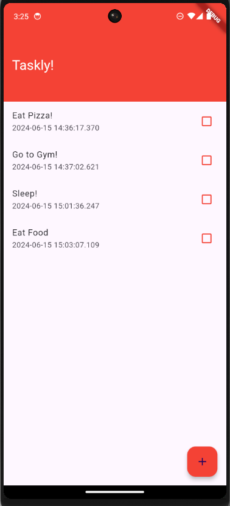
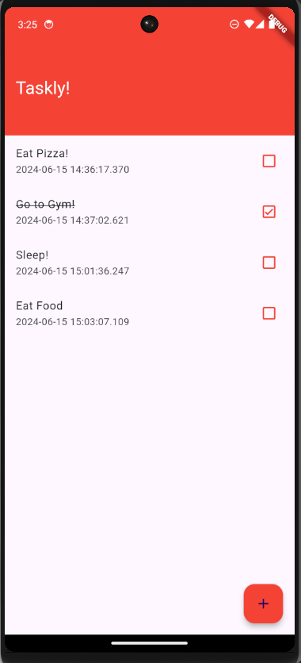
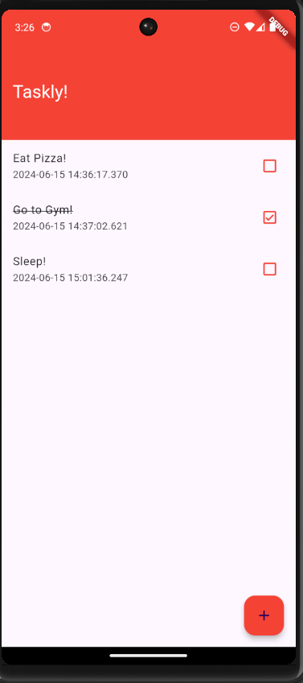
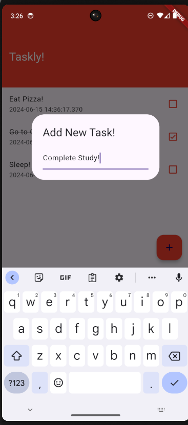

# Taskly

- Taskly is a simple and intuitive to-do app built with Flutter.
- It helps you manage your tasks efficiently and stay organized.
- The app stores its data locally using the Hive database.
- It maintains the state of data, that is, even if you close application and reopen, the to-do status remains the same.

## Working Video
- Click here!
- [Taskly Demo](https://youtube.com/shorts/sAka4Yq2RmA?feature=share)

## Product Image
,
,
,

